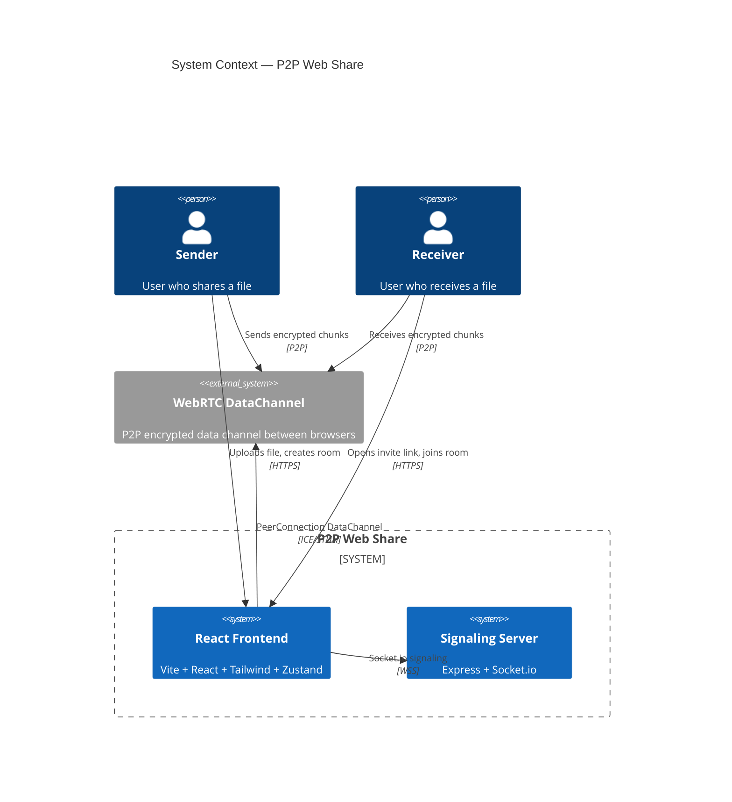
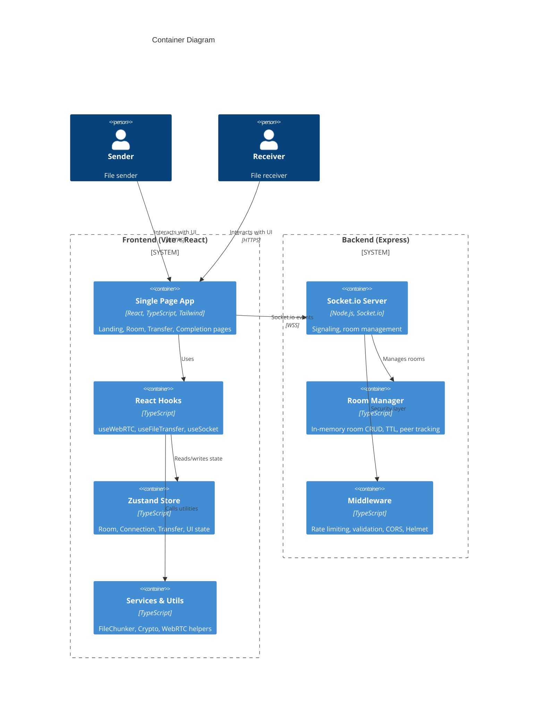
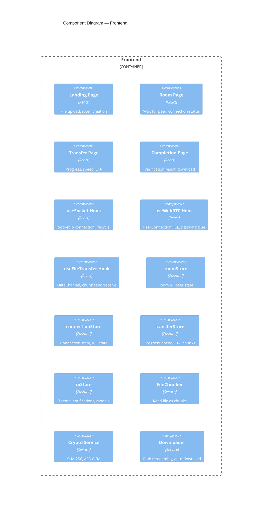
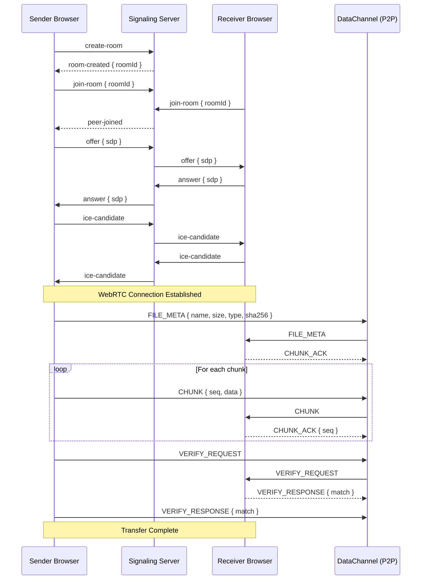
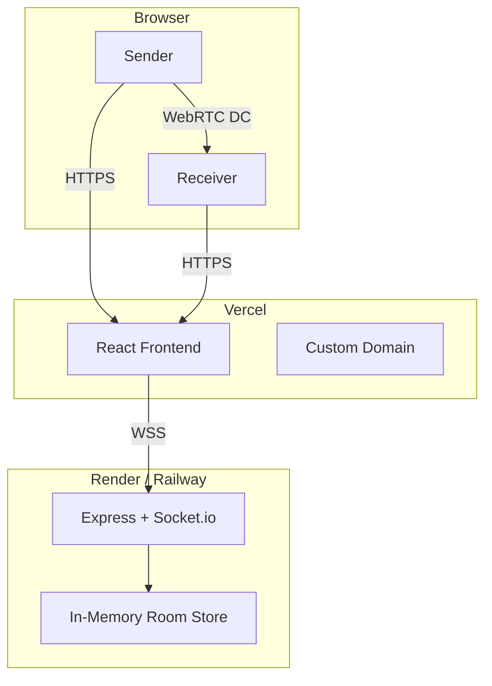

# P2P Web Share — Architecture

## System Context

```mermaid
C4Context
  title System Context — P2P Web Share

  Person(sender, "Sender", "User who shares a file")
  Person(receiver, "Receiver", "User who receives a file")

  System_Boundary(p2p_system, "P2P Web Share") {
    System(frontend, "React Frontend", "Vite + React + Tailwind + Zustand")
    System(backend, "Signaling Server", "Express + Socket.io")
  }

  System_Ext(webrtc, "WebRTC DataChannel", "P2P encrypted data channel between browsers")

  Rel(sender, frontend, "Uploads file, creates room", "HTTPS")
  Rel(receiver, frontend, "Opens invite link, joins room", "HTTPS")
  Rel(frontend, backend, "Socket.io signaling", "WSS")
  Rel(frontend, webrtc, "PeerConnection DataChannel", "ICE/STUN")
  Rel(sender, webrtc, "Sends encrypted chunks", "P2P")
  Rel(receiver, webrtc, "Receives encrypted chunks", "P2P")
```

## Container Diagram

```mermaid
C4Container
  title Container Diagram

  Person(sender, "Sender", "File sender")
  Person(receiver, "Receiver", "File receiver")

  System_Boundary(fe, "Frontend (Vite + React)") {
    Container(spa, "Single Page App", "React, TypeScript, Tailwind", "Landing, Room, Transfer, Completion pages")
    Container(hooks, "React Hooks", "TypeScript", "useWebRTC, useFileTransfer, useSocket")
    Container(store, "Zustand Store", "TypeScript", "Room, Connection, Transfer, UI state")
    Container(services, "Services & Utils", "TypeScript", "FileChunker, Crypto, WebRTC helpers")
  }

  System_Boundary(be, "Backend (Express)") {
    Container(socket, "Socket.io Server", "Node.js, Socket.io", "Signaling, room management")
    Container(roomMgr, "Room Manager", "TypeScript", "In-memory room CRUD, TTL, peer tracking")
    Container(middleware, "Middleware", "TypeScript", "Rate limiting, validation, CORS, Helmet")
  }

  Rel(sender, spa, "Interacts with UI", "HTTPS")
  Rel(receiver, spa, "Interacts with UI", "HTTPS")
  Rel(spa, hooks, "Uses")
  Rel(hooks, store, "Reads/writes state")
  Rel(hooks, services, "Calls utilities")
  Rel(spa, socket, "Socket.io events", "WSS")
  Rel(socket, roomMgr, "Manages rooms")
  Rel(socket, middleware, "Security layer")
```

## Component Diagram

```mermaid
C4Component
  title Component Diagram — Frontend

  Container_Boundary(fe, "Frontend") {
    Component(landing, "Landing Page", "React", "File upload, room creation")
    Component(room, "Room Page", "React", "Wait for peer, connection status")
    Component(transfer, "Transfer Page", "React", "Progress, speed, ETA")
    Component(complete, "Completion Page", "React", "Verification result, download")

    Component(useSocket, "useSocket Hook", "React", "Socket.io connection lifecycle")
    Component(useWebRTC, "useWebRTC Hook", "React", "PeerConnection, ICE, signaling glue")
    Component(useFileTransfer, "useFileTransfer Hook", "React", "DataChannel, chunk send/receive")

    Component(roomStore, "roomStore", "Zustand", "Room ID, peer state")
    Component(connectionStore, "connectionStore", "Zustand", "Connection state, ICE state")
    Component(transferStore, "transferStore", "Zustand", "Progress, speed, ETA, chunks")
    Component(uiStore, "uiStore", "Zustand", "Theme, notifications, modals")

    Component(fileChunker, "FileChunker", "Service", "Read file as chunks")
    Component(crypto, "Crypto Service", "Service", "SHA-256, AES-GCM")
    Component(downloader, "Downloader", "Service", "Blob reassembly, auto-download")
  }
```

## Data Flow — File Transfer

```mermaid
sequenceDiagram
  participant S as Sender Browser
  participant SS as Signaling Server
  participant R as Receiver Browser
  participant DC as DataChannel (P2P)

  S->>SS: create-room
  SS-->>S: room-created { roomId }
  S->>SS: join-room { roomId }
  R->>SS: join-room { roomId }
  SS-->>S: peer-joined
  S->>SS: offer { sdp }
  SS->>R: offer { sdp }
  R->>SS: answer { sdp }
  SS->>S: answer { sdp }
  S->>SS: ice-candidate
  SS->>R: ice-candidate
  R->>SS: ice-candidate
  SS->>S: ice-candidate

  Note over S,R: WebRTC Connection Established

  S->>DC: FILE_META { name, size, type, sha256 }
  DC->>R: FILE_META
  R-->>DC: CHUNK_ACK
  loop For each chunk
    S->>DC: CHUNK { seq, data }
    DC->>R: CHUNK
    R-->>DC: CHUNK_ACK { seq }
  end
  S->>DC: VERIFY_REQUEST
  DC->>R: VERIFY_REQUEST
  R-->>DC: VERIFY_RESPONSE { match }
  S->>DC: VERIFY_RESPONSE { match }
  Note over S,R: Transfer Complete
```

## Deployment

```mermaid
graph TD
  subgraph "Vercel"
    FE[React Frontend]
    DNS[Custom Domain]
  end

  subgraph "Render / Railway"
    BE[Express + Socket.io]
    RM[In-Memory Room Store]
  end

  subgraph "Browser"
    S[Sender]
    R[Receiver]
  end

  S -- HTTPS --> FE
  R -- HTTPS --> FE
  FE -- WSS --> BE
  BE --> RM
  S -- WebRTC DC --> R
```
