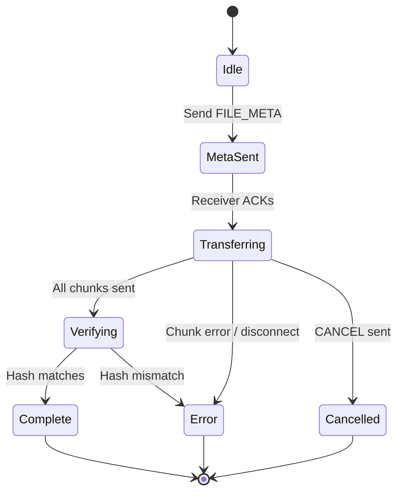
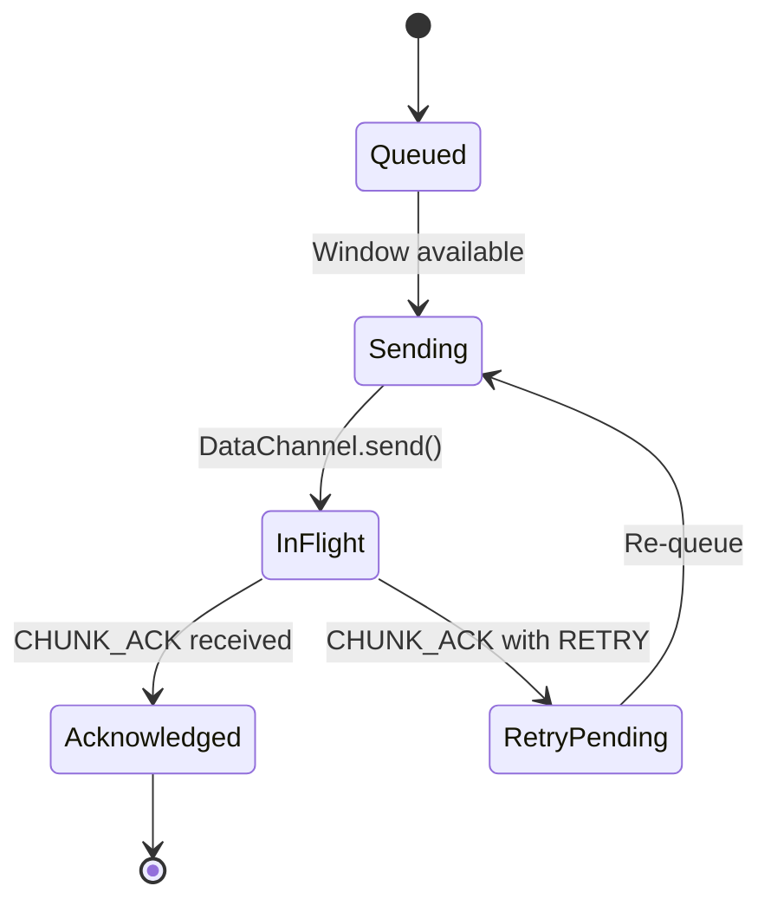

# DataChannel Protocol — P2P Transfer

## Overview

The DataChannel carries all file transfer data directly between peers after WebRTC connection is established. It uses reliable, ordered mode to ensure file integrity.

---

## Connection Model

```
Property          Value
----------------  --------
Mode              Reliable, Ordered
Protocol          Binary (ArrayBuffer)
Label             "p2p-transfer"
Max Packet Size   16 KB (configurable)
```

**Rationale**: Reliable ordered mode guarantees in-order delivery and automatic retransmission. Binary format avoids JSON serialization overhead for large payloads.

---

## Message Envelope

Every message on the DataChannel follows a fixed binary envelope:

```
Byte 0:          Message Type (uint8)
Bytes 1-4:       Payload Length (uint32, big-endian)
Bytes 5+:        Payload (variable)
```

**Maximum message size**: 256 KB (envelope + payload). Chunks exceeding this are split.

---

## Message Types

| Code | Name | Direction | Description |
|------|------|-----------|-------------|
| `0x00` | FILE_META | Sender → Receiver | File metadata before transfer |
| `0x01` | CHUNK | Sender → Receiver | File chunk data |
| `0x02` | CHUNK_ACK | Receiver → Sender | Chunk reception acknowledgment |
| `0x03` | VERIFY_REQUEST | Sender → Receiver | Request integrity verification |
| `0x04` | VERIFY_RESPONSE | Sender → Receiver | Final verification result |
| `0x05` | ERROR | Bidirectional | Error notification |
| `0x06` | CANCEL | Bidirectional | Transfer cancellation |

---

## Payload Schemas

### FILE_META (0x00)

```
Offset  Size  Field
------  ----  ------------------------------
0       4     File name length (uint32)
4       N     File name (UTF-8)
4+N     8     File size (uint64, big-endian)
12+N    2     MIME type length (uint16)
14+N    M     MIME type (UTF-8)
14+N+M  32    SHA-256 hash (binary)
46+N+M  4     Total chunks (uint32)
50+N+M  4     Chunk size (uint32)
```

### CHUNK (0x01)

```
Offset  Size  Field
------  ----  ------------------------------
0       4     Sequence number (uint32)
4       4     Payload size (uint32)
8       N     Chunk data (bytes)
```

Total chunk size = `8 + N` bytes. The `payload size` field allows the receiver to validate chunk completeness.

### CHUNK_ACK (0x02)

```
Offset  Size  Field
------  ----  ------------------------------
0       4     Sequence number (uint32)
4       1     Status (uint8): 0x00 = OK, 0x01 = RETRY
```

### VERIFY_REQUEST (0x03)

```
Offset  Size  Field
------  ----  ------------------------------
0       32    Sender SHA-256 hash (binary)
```

### VERIFY_RESPONSE (0x04)

```
Offset  Size  Field
------  ----  ------------------------------
0       1     Match (uint8): 0x00 = FAIL, 0x01 = MATCH
0       32    Receiver SHA-256 hash (binary) [if match = 0x00, contains computed hash for comparison]
```

### ERROR (0x05)

```
Offset  Size  Field
------  ----  ------------------------------
0       2     Error code (uint16)
2       2     Message length (uint16)
4       N     Error message (UTF-8)
```

**Error codes**: `0x0001` = CHUNK_MISMATCH, `0x0002` = SEQUENCE_GAP, `0x0003` = CHECKSUM_FAIL, `0x0004` = BUFFER_OVERFLOW, `0x0005` = TIMEOUT, `0x00FF` = UNKNOWN

### CANCEL (0x06)

```
Offset  Size  Field
------  ----  ------------------------------
0       2     Reason code (uint16)
2       2     Message length (uint16)
4       N     Message (UTF-8)
```

---

## Transfer Lifecycle



---

## Chunk Lifecycle



---

## Flow Control

The sender implements a sliding-window flow control to prevent buffer bloat:

```
Constants:
  MAX_BUFFERED_AMOUNT = 1 MB     // Max queued data before pausing
  MIN_WINDOW_SIZE     = 4        // Minimum concurrent chunks
  MAX_WINDOW_SIZE     = 64       // Maximum concurrent chunks
  WINDOW_ADJUST_UP    = 2        // Increase window on fast ACKs
  WINDOW_ADJUST_DOWN  = 0.5      // Decrease window on bufferedAmount threshold

Algorithm:
  1. Before sending each chunk:
     if datachannel.bufferedAmount > MAX_BUFFERED_AMOUNT:
         wait for bufferedamountlow event
  2. Track in-flight chunks (sent but not ACKed)
  3. On CHUNK_ACK:
         remove from in-flight set
         if ACK latency < threshold:
             window_size = min(window_size * WINDOW_ADJUST_UP, MAX_WINDOW_SIZE)
  4. On bufferedAmount > 80% MAX_BUFFERED_AMOUNT:
         window_size = max(window_size * WINDOW_ADJUST_DOWN, MIN_WINDOW_SIZE)
  5. Send next chunk if:
         in-flight count < window_size
         AND bufferedAmount < MAX_BUFFERED_AMOUNT
```

## Adaptive Chunk Sizing

Chunk size adjusts based on observed network conditions:

```
Base chunk size: 16 KB
Min chunk size:  4 KB
Max chunk size:  64 KB

Adjustment rules:
  - If average round-trip time < 50 ms: increase chunk size by 4 KB
  - If average round-trip time > 200 ms: decrease chunk size by 4 KB
  - If retransmission rate > 5%: halve chunk size, reset window
  - Re-evaluate every 50 chunks
```

---

## Sequence Numbers

- Sequence numbers are zero-based `uint32`
- Chunks from 0 to `totalChunks - 1`
- Overflow not expected for any practical file size with 16 KB chunks
  - 2^32 chunks × 16 KB ≈ 64 TB max addressable

---

## Timeouts

```
Event                     Timeout    Action
-----                     -------    ------
FILE_META ACK             30 s       Cancel transfer, notify error
CHUNK ACK                 60 s       Retransmit chunk
VERIFY_RESPONSE           30 s       Cancel transfer
Idle (no data)            120 s      Cancel transfer
```

---

## Error Recovery

### Chunk Retransmission
If a CHUNK_ACK is not received within the timeout:
1. Re-queue the chunk for sending
2. Increase retry count
3. If retry count > 5: send ERROR with code `0x0005` (TIMEOUT), cancel transfer

### Sequence Gap Detection
Receiver tracks consecutive sequence numbers:
1. If seq[N+1] arrives but seq[N] is missing: send ERROR `0x0002` (SEQUENCE_GAP)
2. Request retransmission of missing chunk
3. Buffer out-of-order chunks up to 256 entries

### Reconnection
If DataChannel closes mid-transfer:
1. Sender stores last ACKed sequence number
2. On reconnection, sender sends FILE_META with `resumeFrom` field
3. Receiver confirms last received sequence number
4. Transfer resumes from that point

---

## Security Considerations

- All chunk data is encrypted before being sent over the DataChannel (see encryption protocol)
- The DataChannel operates on encrypted DTLS, providing transport-layer security
- Message boundaries are strictly validated to prevent injection attacks
- Unknown message types are silently dropped
- Payload sizes must match declared lengths; mismatches trigger immediate ERROR
