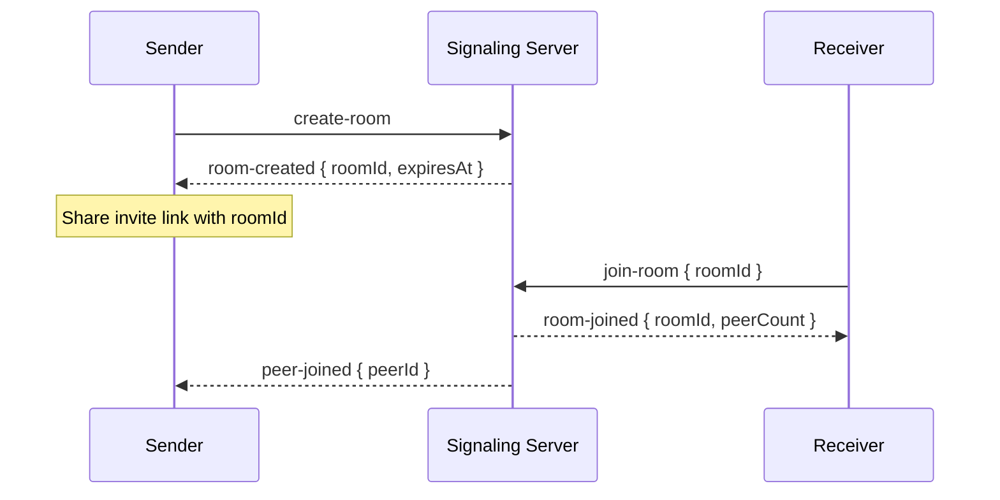
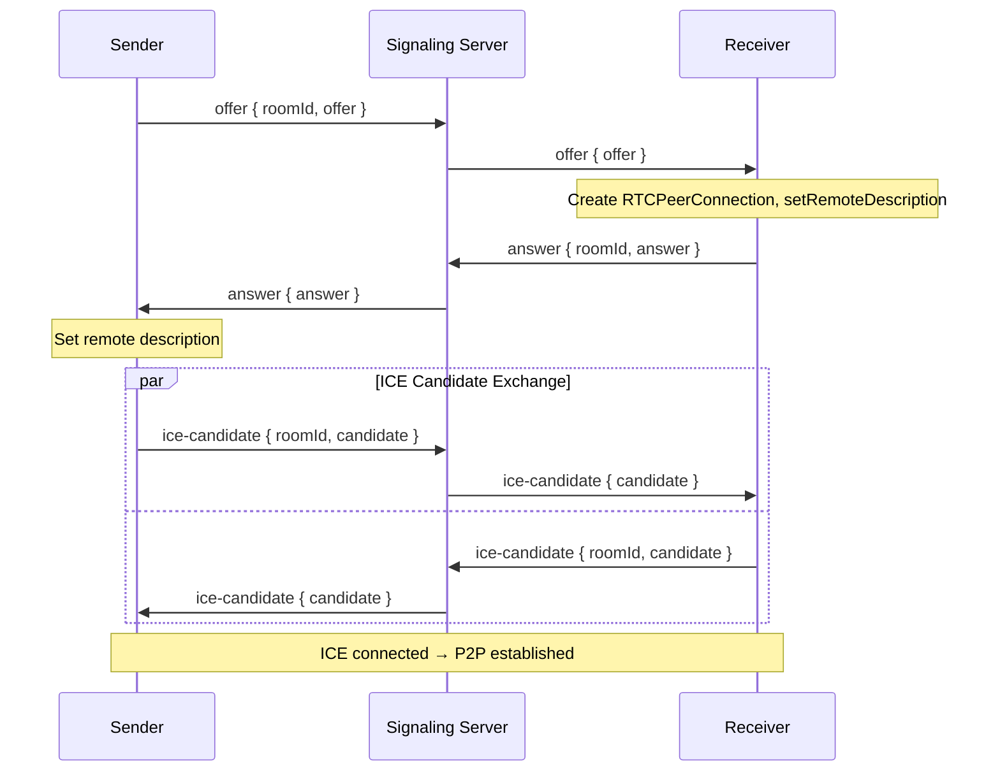
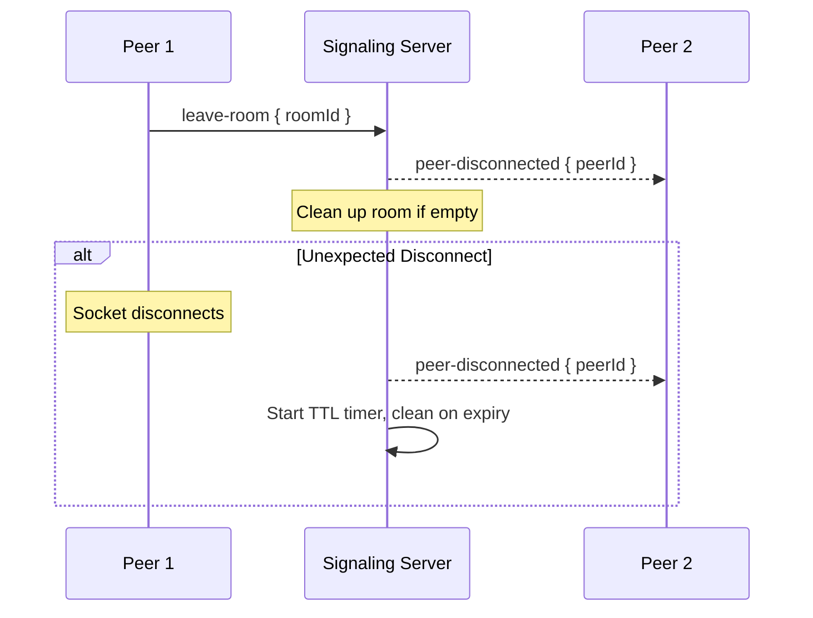

# Signaling Protocol — Socket.io Events

## Overview

The signaling server facilitates WebRTC peer connection setup between browsers. It never handles file data. All signaling messages are routed through Socket.io rooms.

---

## Connection

```
Client → Server: wss://<host>?roomId=<optional>
```

The client connects via Socket.io with secure WebSocket transport. An optional `roomId` query parameter allows pre-binding.

---

## Client-to-Server Events

### `create-room`
Create a new transfer room. The server generates a unique 6-character alphanumeric room ID.

```typescript
// Payload: none
// Response: room-created

interface RoomCreatedPayload {
  roomId: string;           // 6-char alphanumeric
  expiresAt: number;        // Unix ms timestamp (TTL = 30 min)
}
```

### `join-room`
Join an existing room as receiver.

```typescript
interface JoinRoomPayload {
  roomId: string;
}

// Success: room-joined (to joiner)
interface RoomJoinedPayload {
  roomId: string;
  peerCount: number;
}

// Also emits: peer-joined (to existing room member)
interface PeerJoinedPayload {
  peerId: string;           // Socket ID of joining peer
}
```

### `leave-room`
Voluntarily leave a room before transfer.

```typescript
interface LeaveRoomPayload {
  roomId: string;
}
```

### `offer`
Forward SDP offer to the receiving peer.

```typescript
interface OfferPayload {
  roomId: string;
  offer: RTCSessionDescriptionInit;
}
```

### `answer`
Forward SDP answer to the sending peer.

```typescript
interface AnswerPayload {
  roomId: string;
  answer: RTCSessionDescriptionInit;
}
```

### `ice-candidate`
Forward ICE candidate to the remote peer.

```typescript
interface IceCandidatePayload {
  roomId: string;
  candidate: RTCIceCandidateInit;
}
```

### `file-metadata`
Notify remote peer about file metadata before transfer begins.

```typescript
interface FileMetadataPayload {
  roomId: string;
  fileName: string;
  fileSize: number;
  fileType: string;
}
```

### `transfer-complete`
Notify remote peer that transfer finished successfully.

```typescript
interface TransferCompletePayload {
  roomId: string;
  sha256Hash: string;
}
```

### `transfer-error`
Notify remote peer of a transfer error.

```typescript
interface TransferErrorPayload {
  roomId: string;
  error: string;
}
```

---

## Server-to-Client Events

### `room-created`
Sent to room creator after successful room creation.

```typescript
interface RoomCreatedPayload {
  roomId: string;
  expiresAt: number;
}
```

### `room-joined`
Sent to the joining peer after successful join.

```typescript
interface RoomJoinedPayload {
  roomId: string;
  peerCount: number;
}
```

### `peer-joined`
Sent to existing room occupant when a new peer joins.

```typescript
interface PeerJoinedPayload {
  peerId: string;
}
```

### `peer-disconnected`
Sent to remaining peer when the other disconnects.

```typescript
interface PeerDisconnectedPayload {
  peerId: string;
}
```

### `offer`
Forwarded SDP offer to the receiving peer.

```typescript
interface OfferPayload {
  offer: RTCSessionDescriptionInit;
}
```

### `answer`
Forwarded SDP answer to the sending peer.

```typescript
interface AnswerPayload {
  answer: RTCSessionDescriptionInit;
}
```

### `ice-candidate`
Forwarded ICE candidate to the remote peer.

```typescript
interface IceCandidatePayload {
  candidate: RTCIceCandidateInit;
}
```

### `file-metadata`
Forwarded file metadata to the receiving peer.

```typescript
interface FileMetadataPayload {
  fileName: string;
  fileSize: number;
  fileType: string;
}
```

### `room-error`
Sent when an operation fails (invalid room, full room, etc.).

```typescript
interface RoomErrorPayload {
  code: string;             // INVALID_ROOM | ROOM_FULL | ROOM_EXPIRED | INVALID_PAYLOAD
  message: string;
}
```

### `room-expired`
Sent to room occupants when the room TTL expires.

```typescript
interface RoomExpiredPayload {
  roomId: string;
}
```

### `transfer-complete`
Forwarded transfer completion to the receiving peer.

```typescript
interface TransferCompletePayload {
  sha256Hash: string;
}
```

### `transfer-error`
Forwarded transfer error to the remote peer.

```typescript
interface TransferErrorPayload {
  error: string;
}
```

---

## Signaling Flow

### Room Creation & Joining



### WebRTC Connection Setup



### Disconnection



---

## Error Codes

| Code | Message | Description |
|------|---------|-------------|
| `INVALID_ROOM` | Room does not exist | Room ID not found or never created |
| `ROOM_FULL` | Room has reached max peers | Max 2 peers per room |
| `ROOM_EXPIRED` | Room has expired | TTL exceeded (30 min) |
| `INVALID_PAYLOAD` | Malformed event payload | Missing or invalid fields |
| `ALREADY_IN_ROOM` | Already a member | Peer is already in this room |
| `RATE_LIMITED` | Too many requests | Rate limit exceeded |

---

## Room Lifecycle

```
Room Created → TTL = 30 min → Peer 1 Joins → Peer 2 Joins → Transfer → Room Idle → TTL Expiry → Room Destroyed

If peer disconnects during transfer:
  Room stays alive for 5 min → Reconnection window → If no reconnect → Room destroyed
```
