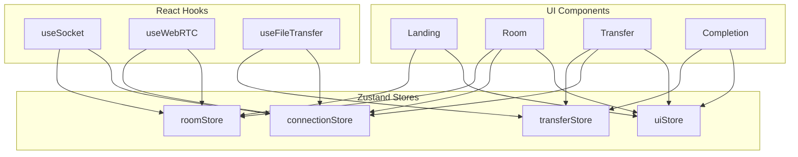

# State Management Architecture — Zustand

## Overview

State management uses Zustand with four isolated stores. Each store is a single-responsibility slice of application state. Stores communicate through React components and hooks, not through direct store-to-store dependencies.

---

## Store Architecture



---

## roomStore

**Purpose**: Manage room lifecycle — creation, joining, membership.

```typescript
interface RoomState {
  // State
  roomId: string | null;
  peerId: string | null;        // Socket ID of remote peer
  peerConnected: boolean;
  roomError: string | null;
  roomPhase: 'idle' | 'creating' | 'waiting' | 'connecting' | 'connected' | 'expired';

  // Actions
  setRoomId: (id: string) => void;
  setPeerId: (id: string) => void;
  setPeerConnected: (connected: boolean) => void;
  setRoomError: (error: string | null) => void;
  setRoomPhase: (phase: RoomState['roomPhase']) => void;
  reset: () => void;
}
```

**State transitions**:

```
idle → creating (user clicks upload, socket connecting)
creating → waiting (room created, waiting for peer)
waiting → connecting (peer joined, WebRTC starting)
connecting → connected (DataChannel open)
connected → idle (transfer complete / error)
any → expired (room TTL reached)
any → idle (reset)
```

---

## connectionStore

**Purpose**: Track WebRTC peer connection and DataChannel state.

```typescript
interface ConnectionState {
  // State
  connectionState: RTCPeerConnectionState;       // 'new' | 'connecting' | 'connected' | 'disconnected' | 'failed' | 'closed'
  iceConnectionState: RTCIceConnectionState;     // 'new' | 'checking' | 'connected' | 'completed' | 'failed' | 'disconnected' | 'closed'
  iceGatheringState: RTCIceGatheringState;       // 'new' | 'gathering' | 'complete'
  dataChannelState: RTCDataChannelState;         // 'connecting' | 'open' | 'closing' | 'closed'
  signalingState: RTCSignalingState;             // 'stable' | 'have-local-offer' | 'have-remote-offer' | 'have-local-pranswer' | 'have-remote-pranswer' | 'closed'
  latencyMs: number | null;

  // Actions
  setConnectionState: (state: RTCPeerConnectionState) => void;
  setIceConnectionState: (state: RTCIceConnectionState) => void;
  setIceGatheringState: (state: RTCIceGatheringState) => void;
  setDataChannelState: (state: RTCDataChannelState) => void;
  setSignalingState: (state: RTCSignalingState) => void;
  setLatency: (ms: number) => void;
  reset: () => void;
}
```

**Derived connection quality**:

```
connected + latency < 100 ms  → "excellent"
connected + latency < 300 ms  → "good"
connected + latency < 500 ms  → "fair"
connected + latency >= 500 ms → "poor"
failed / disconnected         → "disconnected"
```

---

## transferStore

**Purpose**: Track file transfer progress, metadata, and verification.

```typescript
interface TransferState {
  // File metadata
  fileName: string | null;
  fileSize: number | null;
  fileType: string | null;
  sha256Hash: string | null;           // Sender's computed hash
  receiverHash: string | null;         // Receiver's computed hash
  totalChunks: number;
  chunkSizeBytes: number;

  // Progress (sender view = upload, receiver view = download)
  chunksSent: number;
  chunksAcknowledged: number;
  chunksReceived: number;
  bytesTransferred: number;
  currentSpeedBps: number;
  averageSpeedBps: number;
  etaMs: number;
  progressPercent: number;

  // Phase
  transferPhase: 'idle' | 'hashing' | 'meta' | 'transferring' | 'verifying' | 'complete' | 'error' | 'cancelled';

  // Error
  transferError: string | null;
  lastErrorCode: string | null;

  // Resume
  lastAcknowledgedChunk: number;

  // Actions
  setFileMetadata: (meta: Partial<TransferState>) => void;
  setProgress: (progress: Partial<TransferState>) => void;
  setTransferPhase: (phase: TransferState['transferPhase']) => void;
  setTransferError: (error: string | null) => void;
  setSha256Hash: (hash: string) => void;
  setReceiverHash: (hash: string) => void;
  incrementChunksSent: () => void;
  incrementChunksAcknowledged: () => void;
  incrementChunksReceived: () => void;
  updateSpeed: (bytes: number, elapsedMs: number) => void;
  reset: () => void;
}
```

**Progress calculation**:

```typescript
// Sender progress (based on acknowledgments)
progressPercent = (chunksAcknowledged / totalChunks) * 100

// Receiver progress (based on chunks received and reassembled)
progressPercent = (chunksReceived / totalChunks) * 100

// Speed (exponential moving average)
currentSpeedBps = bytesTransferred / elapsedWindowMs * 1000
averageSpeedBps = 0.7 * averageSpeedBps + 0.3 * currentSpeedBps

// ETA
etaMs = ((totalChunks - chunksAcknowledged) * chunkSizeBytes) / (averageSpeedBps / 1000)
```

---

## uiStore

**Purpose**: Manage UI-level state — theme, modals, notifications.

```typescript
interface UIState {
  // Theme
  theme: 'light' | 'dark' | 'system';
  resolvedTheme: 'light' | 'dark';         // Actual applied theme

  // Notifications
  notifications: Notification[];

  // Modals
  activeModal: string | null;
  modalData: unknown | null;

  // Actions
  setTheme: (theme: UIState['theme']) => void;
  addNotification: (notification: Omit<Notification, 'id' | 'timestamp'>) => void;
  dismissNotification: (id: string) => void;
  openModal: (name: string, data?: unknown) => void;
  closeModal: () => void;
  reset: () => void;
}

interface Notification {
  id: string;
  type: 'info' | 'success' | 'warning' | 'error';
  title: string;
  message?: string;
  timestamp: number;
  durationMs: number;
}
```

---

## Store Interaction Pattern

Stores do not import each other. Coordination happens at the hook level:

```typescript
// Example: useFileTransfer hook coordinates transferStore + connectionStore
function useFileTransfer() {
  const { transferPhase, setTransferPhase, ... } = useTransferStore();
  const { dataChannelState } = useConnectionStore();
  const { setRoomPhase } = useRoomStore();

  useEffect(() => {
    if (dataChannelState === 'open' && transferPhase === 'idle') {
      setTransferPhase('meta');
    }
  }, [dataChannelState, transferPhase]);

  useEffect(() => {
    if (transferPhase === 'complete') {
      setRoomPhase('connected');
    }
  }, [transferPhase]);
}
```

---

## Store Factory Pattern

Each store is created using a consistent factory to reduce boilerplate:

```typescript
import { create } from 'zustand';
import { devtools } from 'zustand/middleware';

function createStore<T>(name: string, initializer: StateCreator<T>) {
  return create<T>()(
    devtools(initializer, { name: `p2p-${name}` })
  );
}
```

This enables Redux DevTools integration for debugging without introducing Redux complexity.
